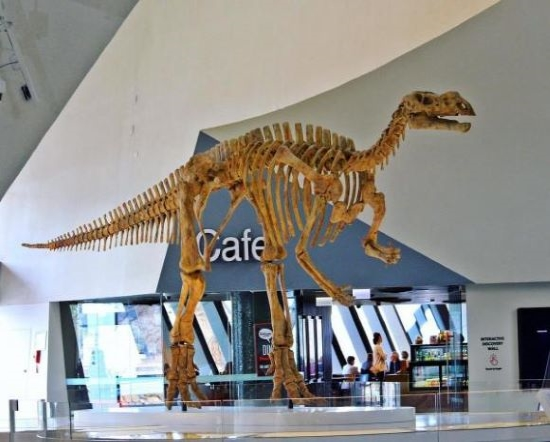
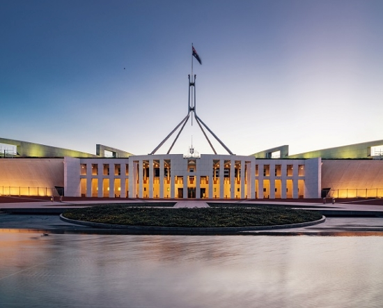
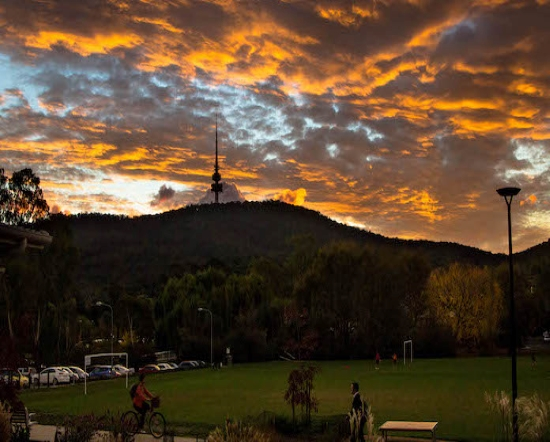
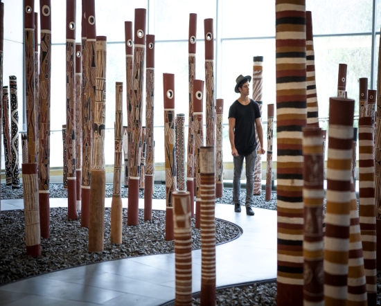
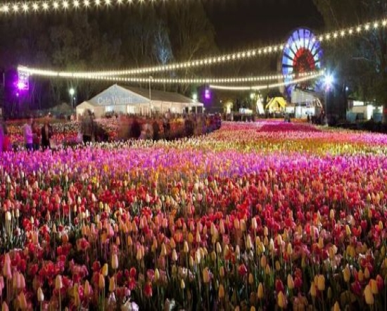
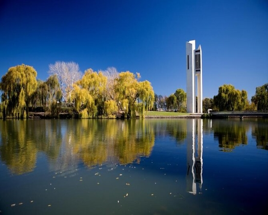
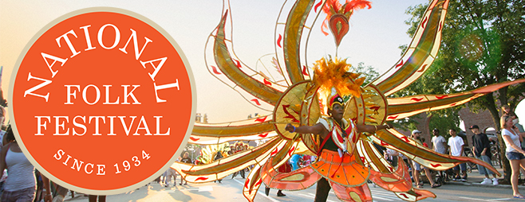
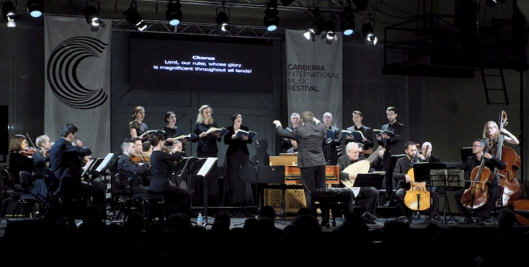

---
# set the layout to use, in this case, the homepage one
layout: layouts/homepage

# set the page title
title: WELCOME TO CANBERRA

## We can set extra info here to use in our templates

hero:
    title: "PARLIAMENT OF AUSTRALIA"
---

### Discover more about Canberra, where nature abounds in this beautiful city. Those who are interested in nature will find Canberra to be a fantastic city to visit. 

### Discover the top-rated attractions & things to do in Canberra by visiting these fantastic places in Canberra.

### Museum

### Parliament House

### Mountains

### Cultural places - Art

### Floriade

### Peaceful environment

### Many national events are held in Canberra, including the National Folk Festival 2022.
Our folk family is both continuing and curious about our new home, so it's a welcome home. In Canberra, Ngunnawal country, to celebrate with us.

### Canberra International Music Festival
Experience a musical adventure together in Canberra.
"The Festival is an event of national significance: stimulating, provocative and deeply satisfying on so many levels." Vincent Plush, The Australian

